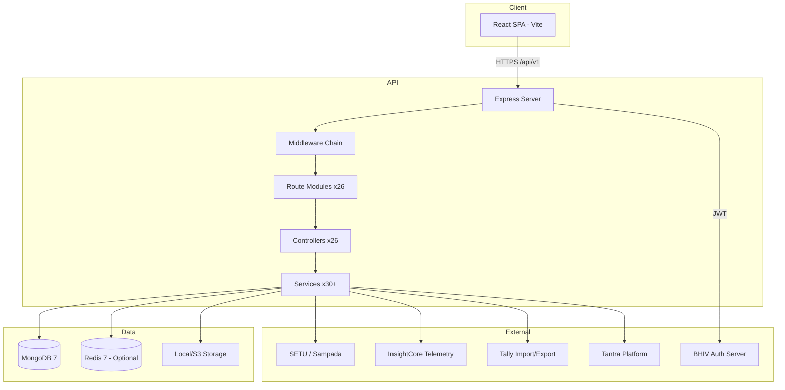
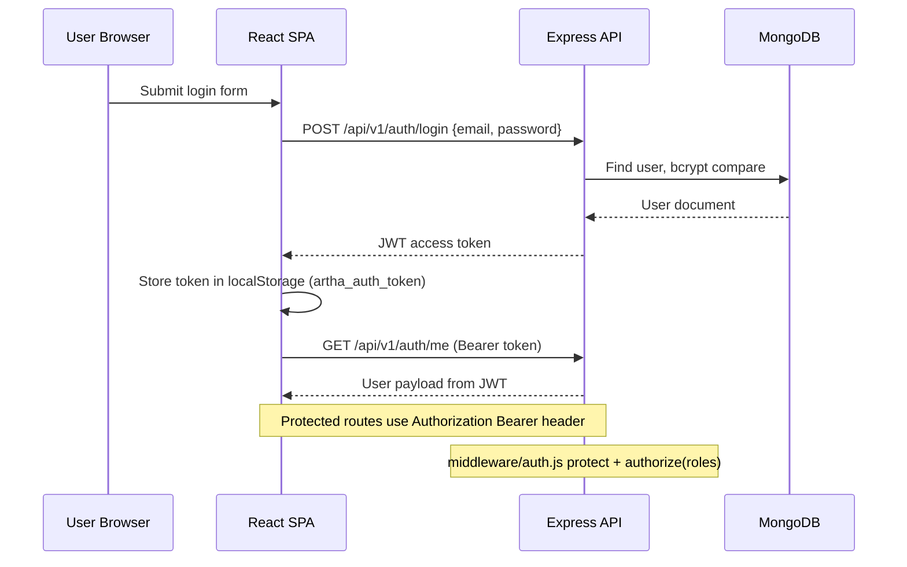
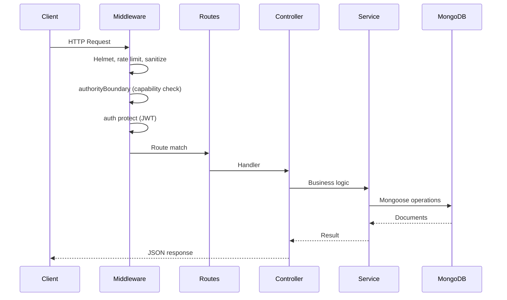

# Architecture — AI-Artha

**Generated:** 2026-07-05

---

## High Level Architecture



---

## Frontend

| Aspect | Detail |
|--------|--------|
| **Framework** | React 18 with Vite 5 |
| **Routing** | React Router 6 (`frontend/src/App.jsx`) |
| **State** | Zustand (`authStore.js`), TanStack Query for server state |
| **Styling** | Tailwind CSS + design system docs in `frontend/src/design-system/` |
| **HTTP Client** | Axios (`frontend/src/services/api.js`) |
| **Entry** | `frontend/src/main.jsx` |
| **Build Output** | `frontend/dist/` served by nginx in production |

### Frontend Route Map

| Path | Page | Access |
|------|------|--------|
| `/login`, `/signup` | Auth pages | Public |
| `/dashboard` | FinancialIntelligenceDashboard | Protected |
| `/invoices/*` | Invoice CRUD | Protected; create/edit: admin, accountant |
| `/expenses/*` | Expense CRUD + approval | Protected; create/approval: admin, accountant |
| `/accounts`, `/journal-entries/*`, `/ledger-integrity` | Accounting | admin, accountant |
| `/reports/*` | Financial reports | Protected |
| `/gst`, `/tds`, `/signals` | Compliance | Signals: admin, accountant |
| `/upload` | SmartUpload | Protected |
| `/statements/*` | Bank statements | Upload: admin, accountant |
| `/settings/company`, `/settings/users` | Settings | admin |

Test pages in `pages/test/` are not routed in `App.jsx`.

---

## Backend

| Aspect | Detail |
|--------|--------|
| **Runtime** | Node.js 18+ (Docker: Node 20 Alpine) |
| **Framework** | Express 4 |
| **Entry** | `backend/src/server.js` |
| **API Prefix** | `/api/v1` |
| **Module System** | ES Modules (`"type": "module"`) |

### Layer Structure

```
server.js
  → middleware (security, auth, authority, cache, monitoring)
  → routes/*.routes.js (26 modules)
  → controllers/*.controller.js (26 files)
  → services/*.service.js (30+ files)
  → models/*.js (32 Mongoose models)
  → config/ (database, redis)
  → utils/ (authToken, helpers)
```

### Controllers (26)
`accounts`, `audit`, `auth`, `banking`, `bankStatement`, `caWorkflow`, `companySettings`, `compliance`, `database`, `expense`, `gst`, `gstFiling`, `insightflow`, `invoice`, `ledger`, `multiCompany`, `ocr`, `pdf`, `performance`, `reports`, `signal`, `smartUpload`, `tally`, `tantra`, `tds`, `users`

### Services (30+)
Core: `ledger`, `invoice`, `expense`, `gst`, `gstFiling`, `gstEngine`, `tds`, `financialReports`, `chartOfAccounts`, `companySettings`, `bankStatement`, `smartUpload`, `ocr`, `pdf`, `export`, `health`, `performance`, `database`, `cache`, `audit`, `banking`, `caWorkflow`, `multiCompany`, `tallyCompatibility`, `statutoryReports`

Integration: `signalEngine`, `setu.pipeline`, `sampadaAdapter`, `traceability`, `runtimeProof`, `observability`, `insightflow`, `tantra`, `evidenceAutomation`

Compliance: `services/compliance/` (gstStatutory, tdsStatutory, tdsLifecycle, signal, validation, export, period.util)

---

## Database

| Aspect | Detail |
|--------|--------|
| **Engine** | MongoDB 7+ |
| **ORM** | Mongoose 8 |
| **Connection** | `backend/src/config/database.js` |
| **Env Var** | `MONGODB_URI`, `MONGODB_TEST_URI` |
| **Transactions** | Requires replica set; degrades gracefully on standalone |
| **Indexing** | `npm run create-indexes` |
| **Seeding** | `scripts/seed.js`, `scripts/seed-tds.js` |
| **Migrations** | Ad-hoc scripts (`migrate-hash-chain.js`) — no formal framework |

32 collections via Mongoose models — see `Handover/07_Database_Details.md`.

---

## Authentication Flow



**Token signing:** `backend/src/utils/authToken.js`  
**Optional app scoping:** `APP_ID` / `BHIV_APP_ID` — JWT must include app in `allowedApps`  
**Legacy support:** Cookie `blackhole_token` accepted by auth middleware

---

## API Flow



**Example — Invoice Send Flow:**
1. `POST /api/v1/invoices/:id/send` → `invoice.controller.sendInvoice`
2. `invoice.service` updates status, creates journal entry
3. `ledger.service` validates double-entry, computes hash chain
4. `signalEngine.service` emits compliance signal
5. Optional SETU dispatch via `setu.pipeline`

---

## Runtime Flow

### Core Accounting Pipeline (from `review_packets/REVIEW_PACKET.md`)

```
Transaction Created (Invoice/Expense/TDS)
  → Journal Entry Created (double-entry enforced)
  → Journal Entry Validated
  → Journal Entry Posted (hash chain updated, balances recalculated)
  → Signal Generated (ComplianceSignal persisted)
  → Filing Created (ComplianceFiling)
  → Filing Validated (ComplianceValidationLog)
  → SETU Dispatch (if SETU_ENABLED=true)
```

### Critical Service Files

| File | Purpose |
|------|---------|
| `services/ledger.service.js` | Core accounting engine, hash chain |
| `models/JournalEntry.js` | Journal model, pre-save hash computation |
| `services/gstEngine.service.js` | GST calculation |
| `services/traceability.service.js` | Unified trace, lineage, replay |
| `services/signalEngine.service.js` | Signal emission |
| `services/setu.pipeline.js` | SETU normalization pipeline |
| `services/financialReports.service.js` | Report generation |

---

## Folder Structure

See `Handover/08_Folder_Structure.md` for complete tree.

---

## Third Party Services

| Service | Integration Point | Config |
|---------|-------------------|--------|
| **MongoDB Atlas** | Primary database | `MONGODB_URI` |
| **Redis** | Response caching | `REDIS_*` |
| **Tesseract.js** | OCR for receipts | optionalDependency |
| **pdf-parse / pdfjs-dist** | PDF text extraction | `ocr.service.js` |
| **SETU / Sampada** | Compliance signal dispatch | `SETU_*`, `POST /api/v1/setu/callback` |
| **InsightCore** | RL experience telemetry | `INSIGHTCORE_*` |
| **AWS S3** | File storage (optional) | `STORAGE_TYPE`, `AWS_*` |
| **BHIV Auth** | Centralized SSO (prod) | `AUTH_SERVER_URL` |
| **Render** | Backend hosting | `backend/render.yaml` |
| **Vercel** | Frontend hosting | `FRONTEND_URL` |
| **Prometheus** | Metrics scraping | `monitoring/prometheus.yml` |
| **Tally** | Import/export | `/api/v1/tally/*` |
| **Tantra** | Operational metadata/evidence | `/api/v1/tantra/*` |

**Payments:** Internal `Payment` model + `banking.service.js` — no external payment gateway (Stripe/Razorpay) found in codebase.

---

## Middleware Stack

Applied in `server.js` (order matters):

| Middleware | File | Purpose |
|------------|------|---------|
| Security headers | `security.js` | Helmet, rate limits, sanitization |
| Authority boundary | `authorityBoundary.js` | Capability contract enforcement |
| Auth | `auth.js` | JWT protect, role authorize |
| Cache | `cache.js` | Redis response caching |
| Upload | `upload.js` | Multer file uploads |
| Monitoring | `monitoring.js` | Request logging, error tracking |
| Performance | `performance.js` | Memory monitoring |
| Validation | `validation.js` | Shared validators |
| Runtime proof | `runtimeProof.js` | Runtime proof middleware |
| RL logger | `rl-logger.js` | InsightFlow RL logging |
