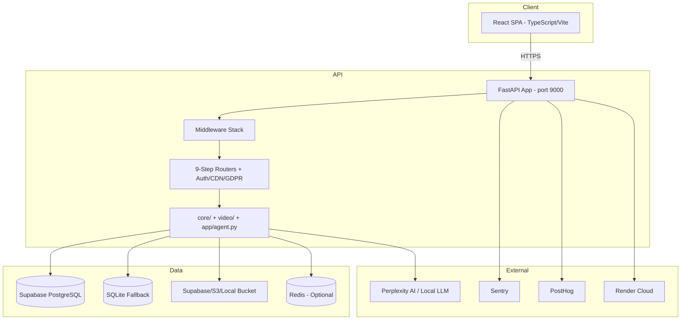
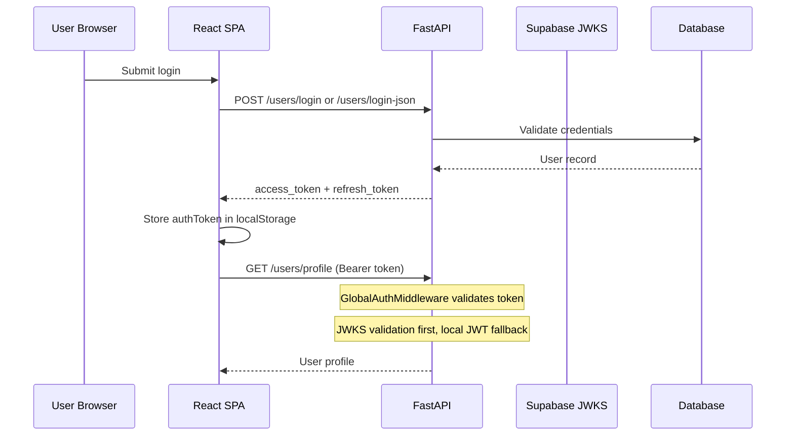

# Architecture — AI-Content

**Generated:** 2026-07-05

---

## High Level Architecture



---

## Frontend

| Aspect | Detail |
|--------|--------|
| **Framework** | React 18 + TypeScript |
| **Build** | Vite 5 |
| **Routing** | React Router 6 (`frontend/src/App.tsx`) |
| **Styling** | Tailwind CSS |
| **HTTP** | Axios (`frontend/src/services/api.ts`) |
| **Auth** | React Context (`AuthContext.tsx`) |
| **Theme** | ThemeContext (dark/light) |
| **Entry** | `frontend/src/main.tsx` |

### Frontend Routes

| Path | Component | Auth |
|------|-----------|------|
| `/` | `LandingPage` | Public |
| `/auth` | `AuthPage` | Public |
| `/dashboard` | `Dashboard` | Protected |
| `*` | Redirect to `/` | — |

### Key Components
- `Navbar.tsx` — Navigation
- `UploadSection.tsx` — File upload UI
- `VideoPreview.tsx` — Video preview/player

---

## Backend

| Aspect | Detail |
|--------|--------|
| **Framework** | FastAPI 0.104 |
| **Server** | Uvicorn |
| **Entry** | `backend/app/main.py` |
| **Port** | 9000 (local), `$PORT` (Render) |
| **Pattern** | Routes in `app/routes.py`; logic in `core/`, `video/`, `app/` |

### Router Mount Order (`main.py`)

| Router | Prefix | Source File |
|--------|--------|---------------|
| Default + step1–9 | (none) | `app/routes.py` |
| Auth | `/users` | `app/auth.py` |
| Simple feedback | (none) | `app/simple_feedback_route.py` |
| CDN | `/cdn` | `app/cdn_fixed.py` |
| Presigned URLs | `/presigned` | `app/presigned_urls.py` |
| GDPR | (none) | `app/gdpr_compliance.py` |
| Jinja dashboard | `/jinja-dashboard` | `app/analytics_jinja.py` |

**Not mounted:** `app/analytics.py`, `app/analytics_dashboard.py` (imported but unused)

### 9-Step Workflow Routers

| Step | Router | Domain |
|------|--------|--------|
| 1 | `step1_router` | System health, demo login |
| 2 | `step2_router` | User invite, email verification |
| 3 | `step3_router` | Upload, video generation |
| 4 | `step4_router` | Content access, download, stream |
| 5 | `step5_router` | Feedback, tag recommendations |
| 6 | `step6_router` | Analytics, monitoring, webhooks |
| 7 | `step7_router` | Task queue |
| 8 | `step8_router` | Maintenance, bucket cleanup |
| 9 | `step9_router` | Dashboard |

### Core Modules (`core/`)

| Module | Purpose |
|--------|---------|
| `database.py` | DatabaseManager, Supabase → SQLite fallback |
| `models.py` | SQLModel table definitions |
| `bhiv_bucket.py` | Local JSON bucket storage |
| `bhiv_core.py` | Content analysis pipeline |
| `bhiv_lm_client.py` | LLM client (Perplexity/local) |
| `s3_storage.py` | S3/MinIO adapter |
| `sentiment_analyzer.py` | VADER sentiment |
| `system_logger.py` | Structured logging |

### Video Pipeline (`video/`)

| Module | Purpose |
|--------|---------|
| `generator.py` | MoviePy video generation |
| `storyboard.py` | Storyboard creation |
| `failed_cases.py` | Failed generation handling |

### RL Agent (`app/agent.py`)
Q-learning agent for content tag recommendations based on feedback rewards.

---

## Database

| Aspect | Detail |
|--------|--------|
| **ORM** | SQLModel (SQLAlchemy-based) |
| **Migrations** | Alembic (`migrations/`) |
| **Primary** | PostgreSQL via Supabase (`DATABASE_URL`) |
| **Fallback** | SQLite (`sqlite:///./ai_agent.db` or `./data.db`) |
| **Connection** | `core/database.py` → `DatabaseManager` |
| **Init** | `create_db_and_tables()` at startup |

**Note:** Some code paths use raw `sqlite3.connect('data.db')` alongside SQLModel — TODO: Verify consistency.

---

## Authentication Flow



**Key files:**
- `app/auth.py` — Register, login, refresh, profile
- `app/security.py` — JWTManager, SecurityManager
- `app/jwks_auth.py` — Supabase JWKS validation
- `app/auth_middleware.py` — GlobalAuthMiddleware

**Public paths (no auth required):**
`/health`, `/docs`, `/openapi.json`, `/redoc`, `/users/login`, `/users/register`, `/demo-login`

---

## API Flow (Content Upload → Video)

```
1. POST /upload (async) → content stored, task queued
2. Content analysis via bhiv_core.py
3. POST /generate-video → storyboard + MoviePy generation
4. GET /content/{id} → retrieve metadata
5. GET /stream/{id} or /download/{id} → serve video
6. POST /feedback → RL agent learns, sentiment analyzed
7. GET /recommend-tags/{content_id} → tag suggestions
```

---

## Runtime Flow

### Middleware Stack (order in `main.py`)

1. `InputValidationMiddleware` — 100MB body limit
2. `GlobalAuthMiddleware` — Bearer token enforcement
3. `RequestIDMiddleware` — Request ID tracking
4. `StructuredLoggingMiddleware` — JSON logging
5. `RateLimitMiddleware` — Redis/in-memory rate limits
6. `CORSMiddleware` — CORS (`allow_origins=["*"]`)
7. Custom HTTP middleware — `X-Process-Time` header

**Also defined in `app/middleware.py` (not all mounted):**
AuthenticationMiddleware, ObservabilityMiddleware, UserContextMiddleware, ErrorHandlingMiddleware, RequestLoggingMiddleware

---

## Folder Structure

See `Handover/08_Folder_Structure.md`.

---

## Third Party Services

| Service | Usage | Config |
|---------|-------|--------|
| **Supabase** | PostgreSQL DB, optional storage, JWKS auth | `SUPABASE_*`, `DATABASE_URL` |
| **Render** | Production hosting | `render.yaml` |
| **Docker Hub** | Container registry | CI workflow |
| **Perplexity AI** | LLM storyboard/improvement | `BHIV_LM_URL`, `PERPLEXITY_API_KEY` |
| **Sentry** | Error tracking | `SENTRY_DSN` |
| **PostHog** | Product analytics | `POSTHOG_API_KEY` |
| **Redis** | Rate limiting, Celery tasks | `REDIS_URL` |
| **AWS S3 / MinIO / R2** | Object storage | `S3_*`, `USE_S3_STORAGE` |
| **Prometheus** | Metrics scraping | `/metrics/prometheus` |
| **Codecov** | CI coverage | CI workflow |
| **MoviePy / FFmpeg** | Video generation | System dependency |
| **VADER Sentiment** | Feedback analysis | vaderSentiment package |
| **PyTorch / Transformers** | ML components | requirements.txt |

---

## Storage Backends

| Backend | Config | Module |
|---------|--------|--------|
| Supabase Storage | `USE_SUPABASE_STORAGE=true` | Supabase SDK |
| S3/MinIO | `USE_S3_STORAGE=true` | `core/s3_storage.py` |
| Local JSON bucket | `BHIV_STORAGE_BACKEND=local` | `core/bhiv_bucket.py` |
| Presigned URLs | `/presigned/*` routes | `app/presigned_urls.py` |

---

## Task Queue

| Backend | Config | Notes |
|---------|--------|-------|
| In-memory | `TASK_QUEUE_BACKEND=memory` | Default |
| Celery + Redis | `TASK_QUEUE_BACKEND=celery` | Optional |

Endpoints: `GET /tasks/{task_id}`, `GET /tasks/queue/stats`, `POST /tasks/create-test`
