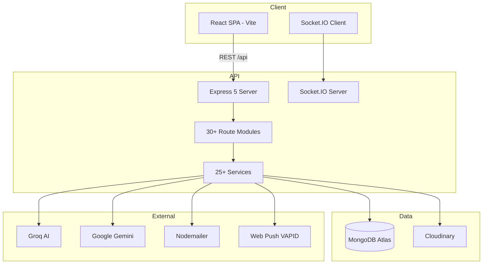
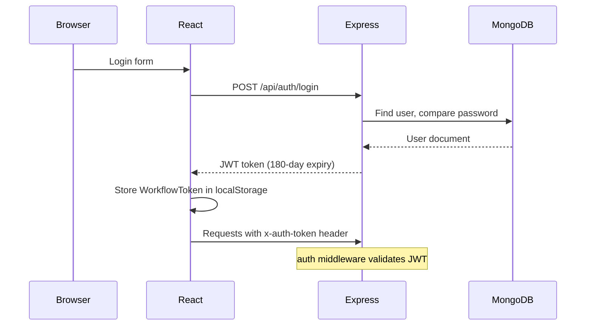

# Architecture — AI-CRM

**Generated:** 2026-07-05  
**App path:** `Downloads/workflow-blackhole-main/`

---

## High Level Architecture

---

## Frontend

| Aspect | Detail |
|--------|--------|
| **Framework** | React 18+ with Vite 6 |
| **Routing** | React Router 7 (`client/src/App.jsx`) |
| **State** | Context API: Auth, Socket, Workspace, Dashboard |
| **UI** | Tailwind CSS 4 + Shadcn/Radix components |
| **Real-time** | Socket.IO client |
| **API Client** | `client/src/lib/api.js` |
| **Auth** | `client/src/context/auth-context.jsx` |

### Major Frontend Routes

Auth: `/login`, `/register`, `/forgot-password`, `/reset-password/:token`  
Dashboards: `/dashboard`, `/admindashboard`, `/userdashboard`  
Tasks: `/tasks`, `/tasks/:id`, `/dependencies`, `/completedtask`  
Attendance: `/attendance-dashboard`, `/leave-request`  
Salary: `/enhanced-salary-dashboard`, `/new-salary-management`, `/biometric-salary-management`  
Monitoring: `/monitoring`, `/inactivity-tracking`, `/prana-demo`  
Admin: `/user-management`, `/ems-dashboard`, `/procurement-dashboard`, `/settings`

---

## Backend

| Aspect | Detail |
|--------|--------|
| **Runtime** | Node.js, Express 5.1 |
| **Entry** | `server/index.js` |
| **Port** | 5001 (default in code) |
| **Pattern** | Route handlers in `routes/`; logic in `services/`; 3 controllers |

### Mounted Route Modules (~30)

`auth`, `users`, `user-notifications`, `tasks`, `departments`, `admin`, `dashboard` + `dashboardFixed`, `submission`, `progress`, `ai`, `aiRoutes`, `notifications`, `aims_universal`, `enhancedAims`, `push`, `monitoring`, `emsSignals`, `attendance`, `attendanceDashboard`, `leave`, `enhancedSalary`, `hourlyBasedSalary`, `newSalaryManagement`, `biometricAttendance`, `consent`, `alerts`, `ems`, `procurement`, `chatbot`, `prana`

### Middleware (`server/middleware/`)

| File | Purpose |
|------|---------|
| `auth.js` | JWT via `x-auth-token` header |
| `adminAuth.js` | Requires Admin or Manager role |
| `procurementAuth.js` | Procurement Agent access |
| `complianceAuth.js` | Exists but compliance routes not mounted |
| `aimSync.js` | AIM sync helper |

### Services (`server/services/` — 25+)

`attendanceService`, `attendanceCronJobs`, `attendanceSalaryService`, `activityTracker`, `screenCapture`, `intelligentScreenCapture`, `websiteMonitor`, `keystrokeAnalytics`, `groqAIService`, `groqService`, `ocrAnalysisService`, `emsAutomation`, `procurementAgent`, `aiReviewService`, `reportGenerator`, `salaryCalculator`, `enhancedSalaryCalculator`, `biometricProcessor`, `consentManager`, `complianceAuditLogger`, `auditLogService`, `geolocationService`, `workingHoursCalculator`, `ems_signals`

### Controllers (`server/controllers/`)

- `hourlyBasedSalaryController.js`
- `enhancedSalaryController.js`
- `salaryController.js` (used by unmounted salaryRoutes.js)

---

## Database

| Aspect | Detail |
|--------|--------|
| **ORM** | Mongoose 8.x |
| **Connection** | `mongoose.connect(process.env.MONGODB_URI)` in index.js |
| **Migrations** | None — ad-hoc scripts in `server/scripts/` |
| **Models** | 36 Mongoose models in `server/models/` |

---

## Authentication Flow

> **Security issue:** Passwords compared as plain text in login handler.

---

## Real-Time (Socket.IO)

- Server and client use Socket.IO 4.8
- Socket URL derived from `VITE_API_URL` with `/api` stripped
- Used for attendance updates, task notifications, alerts

---

## Background Jobs (in index.js)

| Job | Schedule | Purpose |
|-----|----------|---------|
| Midnight auto-end | Daily midnight | Auto-end unended attendance, WFH 8h cap |
| Attendance persistence | Daily 11:59 PM | Cron via attendanceCronJobs.js |
| Historical sync | On startup | Sync last 30 days |

---

## Third Party Services

| Service | Usage |
|---------|-------|
| MongoDB Atlas | Primary database |
| Cloudinary | Screenshot/violation storage |
| Groq | AI insights/optimization |
| Google Gemini | AI analysis |
| Nodemailer | EMS, password reset, welcome emails |
| Web Push (VAPID) | Browser push notifications |
| Vercel | Frontend hosting |
| Render | Backend hosting |
| Tesseract.js | OCR on screenshots |
| screenshot-desktop | Server-side screen capture |

---

## Unmounted Legacy Code

20+ route files in `server/routes/` not imported in `index.js` — see `Handover/06_API_Documentation.md`

Nested legacy snapshot: `server/Complete-Infiverse-main/` (docs only)
